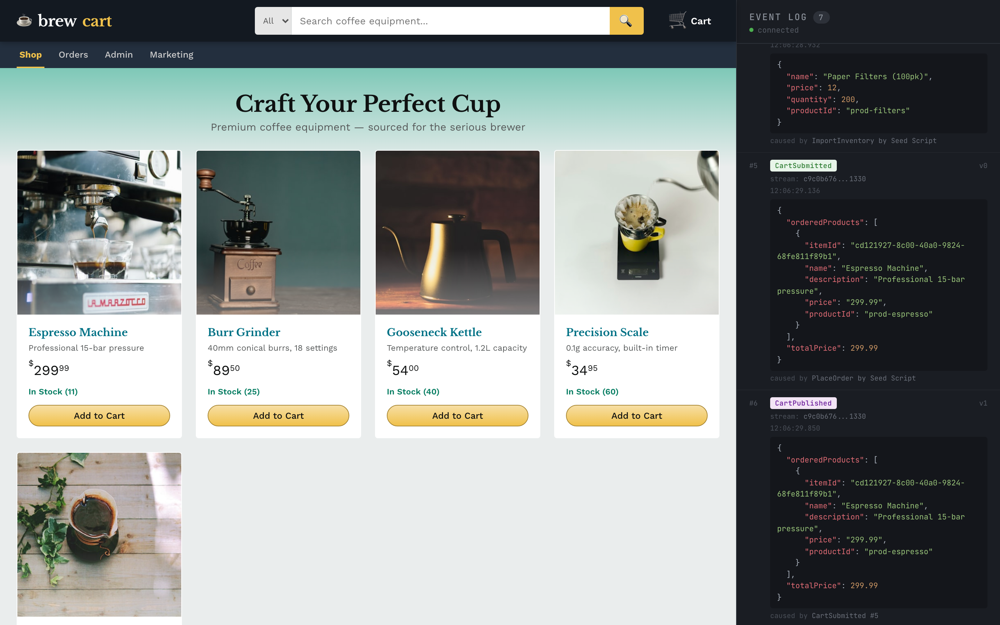
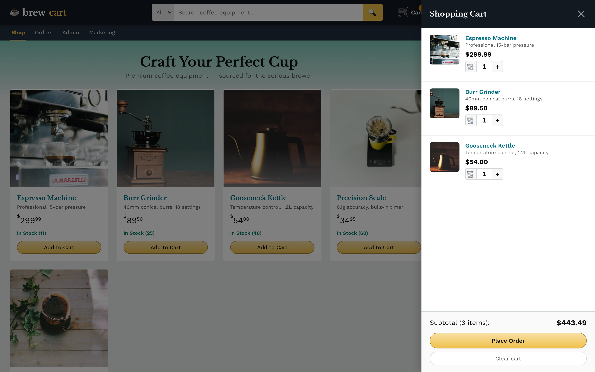
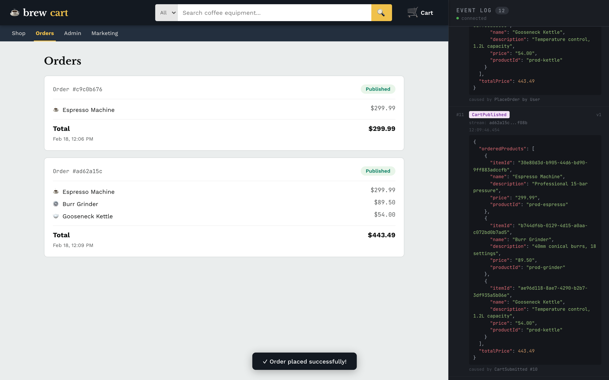
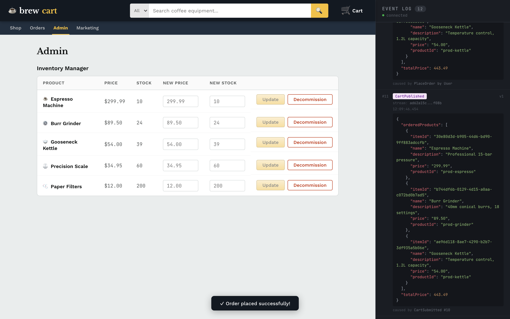
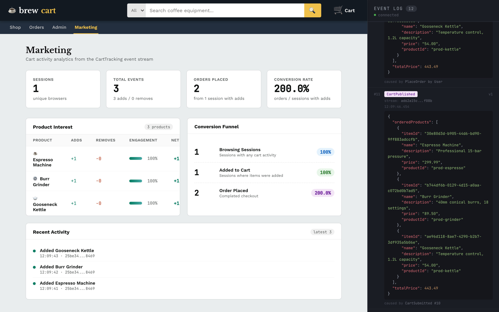

# ES Course — Event-Sourced Shopping Cart

An event-sourced shopping cart application built with the [@rotorsoft/act](https://github.com/Rotorsoft/act) framework. Demonstrates event sourcing patterns including aggregates, reactions, projections, and fire-and-forget tracking — all composed into a single application from independent domain slices.



## Prerequisites

- Node.js >= 22.18.0
- pnpm >= 10.27.0

## Quick Start

```sh
pnpm install
pnpm dev          # API (port 4000) + React client (port 5173)
```

Other commands:

```sh
pnpm test         # Run all tests (vitest)
pnpm typecheck    # Type-check all packages
pnpm build        # Build all packages
```

---

## Architecture

```
packages/
  domain/src/
    schemas.ts        Zod schemas — actions, events, state
    cart.ts           Cart aggregate + CartSlice (reaction: auto-publish)
    inventory.ts      Inventory aggregate + projection + InventorySlice
    tracking.ts       CartTracking aggregate + projection + CartTrackingSlice
    orders.ts         Orders projection (read model)
    invariants.ts     Business rules (must be open)
    bootstrap.ts      Composes slices into the app
    index.ts          Public exports
  domain/test/
    cart.spec.ts      20 tests covering all slices
  app/src/
    api/index.ts      tRPC router (mutations, queries, SSE)
    client/App.tsx    Single-file React app (5 views)
    dev-server.ts     Dev server with seed data
```

The monorepo has two packages:

| Package | Purpose |
|---------|---------|
| `@rotorsoft/es-course-domain` | Pure domain logic — aggregates, projections, invariants. No I/O. |
| `@rotorsoft/es-course-app` | Full-stack — tRPC API server + React/Vite client with SSE streaming. |

---

## Domain Slices

The domain is built from three independent **slices**, each owning its own aggregate, events, state, and projections. Each slice is self-contained in its own file and composed in `bootstrap.ts`.

### Cart Slice (`cart.ts`)

The order lifecycle aggregate. A cart starts `Open`, accepts a `PlaceOrder` command (which validates invariants), emits `CartSubmitted`, then a **reaction** defined within the slice automatically fires `PublishCart` to emit `CartPublished`. The Orders projection is also bundled into this slice.

```
PlaceOrder ──► CartSubmitted ──► (reaction) ──► PublishCart ──► CartPublished
```

```ts
// cart.ts — aggregate
export const Cart = state({ Cart: CartState })
  .init(() => ({ status: "Open", totalPrice: 0 }))
  .emits({ CartSubmitted, CartPublished })
  .patch({
    CartSubmitted: ({ data }) => ({
      status: "Submitted",
      totalPrice: data.totalPrice,
    }),
    CartPublished: ({ data }) => ({
      status: "Published",
      totalPrice: data.totalPrice,
    }),
  })
  .on({ PlaceOrder })
  .given([mustBeOpen])
  .emit((data) => [
    "CartSubmitted",
    {
      orderedProducts: data.items,
      totalPrice: data.items.reduce(
        (sum, item) => sum + parseFloat(item.price || "0"), 0
      ),
    },
  ])
  .on({ PublishCart })
  .emit((data) => ["CartPublished", data])
  .build();

// cart.ts — slice with reaction + Orders projection
export const CartSlice = slice()
  .withState(Cart)
  .withProjection(OrdersProjection)
  .on("CartSubmitted")
  .do(async function publishCart(event, stream, app) {
    await app.do(
      "PublishCart",
      { stream, actor: { id: "system", name: "CartPublisher" } },
      { orderedProducts: event.data.orderedProducts, totalPrice: event.data.totalPrice },
      event
    );
  })
  .to((event) => ({ target: event.stream }))
  .build();
```

### Inventory Slice (`inventory.ts`)

Per-product inventory tracking with import, adjust, and decommission lifecycle. Includes a **projection** that maintains a live read model of stock levels, and also reacts to `CartPublished` events from other slices.

```
ImportInventory ──► InventoryImported
AdjustInventory ──► InventoryAdjusted
DecommissionInventory ──► InventoryDecommissioned
```

```ts
// inventory.ts — projection listens to events from multiple slices
export const InventoryProjection = projection("inventory")
  .on({ InventoryImported })
  .do(async (event) => {
    inventory.set(event.data.productId, { ... });
  })
  .on({ InventoryAdjusted })
  .do(async (event) => {
    // Update price and quantity
  })
  .on({ InventoryDecommissioned })
  .do(async (event) => {
    inventory.delete(event.data.productId);
  })
  .on({ CartPublished })
  .do(async (event) => {
    // Decrement stock for each ordered item
    for (const [productId, count] of counts) {
      const existing = inventory.get(productId);
      if (existing) existing.quantity = Math.max(0, existing.quantity - count);
    }
  })
  .build();

// inventory.ts — slice bundles Cart (for CartPublished), Inventory, and projection
export const InventorySlice = slice()
  .withState(Cart)
  .withState(Inventory)
  .withProjection(InventoryProjection)
  .build();
```

### CartTracking Slice (`tracking.ts`)

Append-only aggregate for marketing analytics. Captures browsing behavior (add/remove/clear) without affecting the order flow. Fire-and-forget from the client — no drain needed, no invariants, no error handling that blocks the UI.

One stream per browser session (keyed by UUID).

```
TrackCartActivity ──► CartActivityTracked
```

```ts
// tracking.ts — aggregate
export const CartTracking = state({ CartTracking: CartTrackingState })
  .init(() => ({ eventCount: 0 }))
  .emits({ CartActivityTracked })
  .patch({
    CartActivityTracked: (_event, state) => ({
      eventCount: state.eventCount + 1,
    }),
  })
  .on({ TrackCartActivity })
  .emit((data) => ["CartActivityTracked", data])
  .build();

// tracking.ts — slice bundles aggregate + projection
export const CartTrackingSlice = slice()
  .withState(CartTracking)
  .withProjection(CartTrackingProjection)
  .build();
```

---

## Composition

Each slice is self-contained — aggregate, projection, and reactions are defined together in a single file. The `bootstrap.ts` file simply wires the slices into the app:

```ts
// bootstrap.ts
import { act } from "@rotorsoft/act";
import { CartSlice } from "./cart.js";
import { InventorySlice } from "./inventory.js";
import { CartTrackingSlice } from "./tracking.js";

export const app = act()
  .withSlice(CartSlice)
  .withSlice(InventorySlice)
  .withSlice(CartTrackingSlice)
  .build();
```

### How the pieces connect

```
┌─────────────────────────────────────────────────────────┐
│                      Event Store                        │
│  (single append-only log, shared by all slices)         │
└────────┬──────────────────┬───────────────────────┬─────┘
         │                  │                       │
    CartSlice         InventorySlice         CartTrackingSlice
    ┌────────┐        ┌────────────┐         ┌──────────────┐
    │ Cart   │        │ Inventory  │         │ CartTracking │
    │ agg.   │        │ agg.       │         │ agg.         │
    └───┬────┘        └─────┬──────┘         └──────┬───────┘
        │                   │                       │
        ▼                   ▼                       ▼
   ┌─────────┐       ┌───────────┐          ┌───────────────┐
   │ Orders  │       │ Inventory │          │ CartTracking  │
   │ proj.   │       │ proj.     │          │ proj.         │
   └─────────┘       └───────────┘          └───────────────┘
        │                  │                       │
        ▼                  ▼                       ▼
   Orders View        Admin View            Marketing View
```

---

## UI Views

The React client is a single-file app (`App.tsx`) with five tabs and a live event log panel.

### Shop

Product catalog with live inventory counts and prices. Cart is fully local (React state). Only `PlaceOrder` talks to the server.


### Cart Drawer

Slide-out cart with quantity controls. Each add/remove/clear fires a tracking event to the server (fire-and-forget).



### Orders

Read model materialized by the Orders projection from `CartSubmitted` and `CartPublished` events. Shows order status progression.



### Admin

Inventory management — adjust prices and stock levels, or decommission products. Each action emits domain events that flow through projections.



### Marketing

Analytics dashboard built from the CartTracking projection. Shows:

- **KPI cards** — sessions, total events, orders placed, conversion rate
- **Product Interest** — per-product adds/removes with engagement bars
- **Conversion Funnel** — sessions → adds → orders → abandoned
- **Activity Timeline** — recent tracking events with timestamps

Data updates live via SSE event invalidation.



---

## Event Flow

Every action in the system produces events that flow through the store:

| Event | Source | Consumed By |
|-------|--------|-------------|
| `CartSubmitted` | Cart aggregate | Orders proj., Reaction (PublishCart) |
| `CartPublished` | Cart aggregate (via reaction) | Orders proj., Inventory proj. |
| `InventoryImported` | Inventory aggregate | Inventory proj. |
| `InventoryAdjusted` | Inventory aggregate | Inventory proj. |
| `InventoryDecommissioned` | Inventory aggregate | Inventory proj. |
| `CartActivityTracked` | CartTracking aggregate | CartTracking proj. |

The Event Log panel (right sidebar) shows every event in real time via SSE subscription.

---

## API

The tRPC router exposes mutations for commands, queries for read models, and an SSE subscription for live events.

**Mutations (commands):**

| Endpoint | Description |
|----------|-------------|
| `PlaceOrder` | Submit a complete order (drains reactions + projections) |
| `ImportInventory` | Seed a product into inventory |
| `AdjustInventory` | Update price/stock for a product |
| `DecommissionInventory` | Remove a product from inventory |
| `TrackCartActivity` | Fire-and-forget browsing event (no drain) |

**Queries (read models):**

| Endpoint | Description |
|----------|-------------|
| `getProducts` | Live product list (prices + stock from Inventory projection) |
| `getInventory` | Raw inventory map (all products) |
| `listOrders` | All orders (from Orders projection) |
| `getCartActivity` | Activity log (from CartTracking projection) |

**Subscription:**

| Endpoint | Description |
|----------|-------------|
| `onEvent` | SSE stream of all committed events |

---

## Testing

20 tests cover all domain slices:

```sh
pnpm test
```

Test structure:

- **Cart** — PlaceOrder lifecycle, invariant enforcement, reaction-driven publish
- **Inventory** — Import, adjust, decommission, cross-slice stock decrement on CartPublished
- **Orders projection** — Materialization from CartSubmitted/CartPublished
- **CartTracking** — Event emission, state accumulation, projection materialization, non-interference with order flow

Tests use `store().seed()` for isolation and `app.correlate()` + `app.drain()` to process reactions and projections.

### Coverage

```sh
npx vitest run --coverage
```

---

## Screenshots

To regenerate screenshots (requires Playwright and a running dev server):

```sh
pnpm dev &
node docs/screenshots.mjs
```
